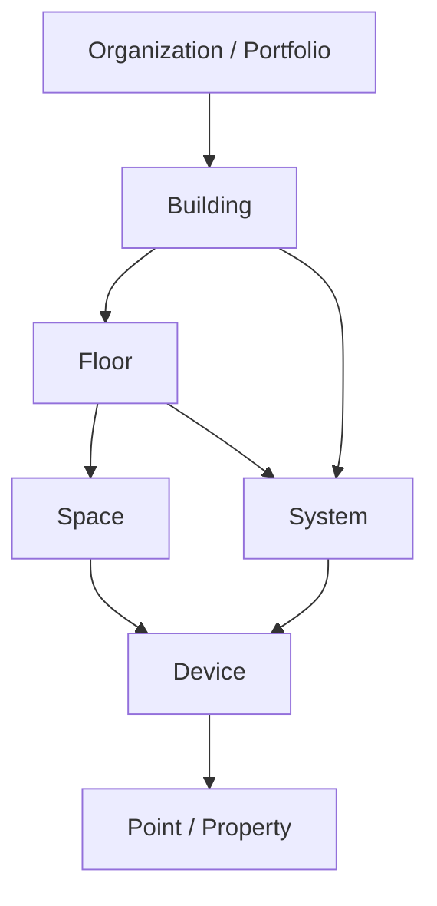
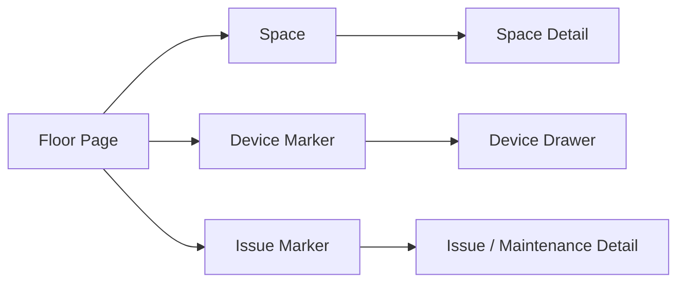
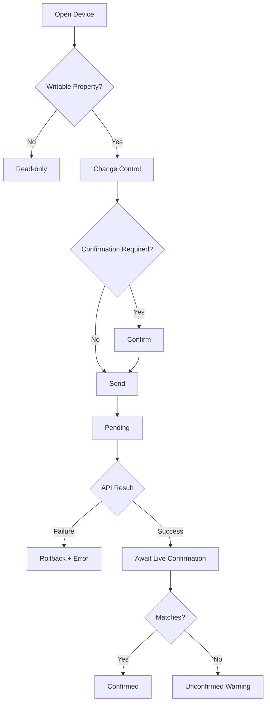
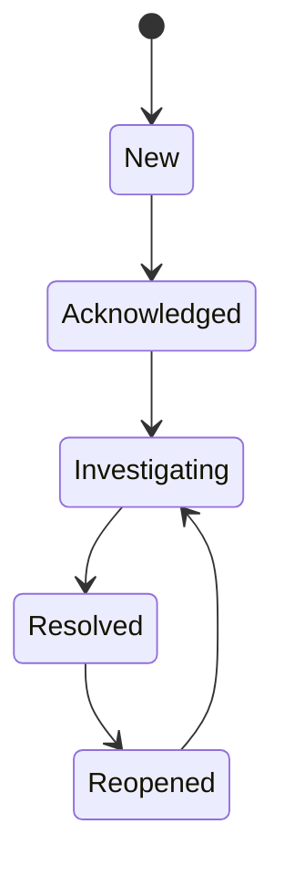
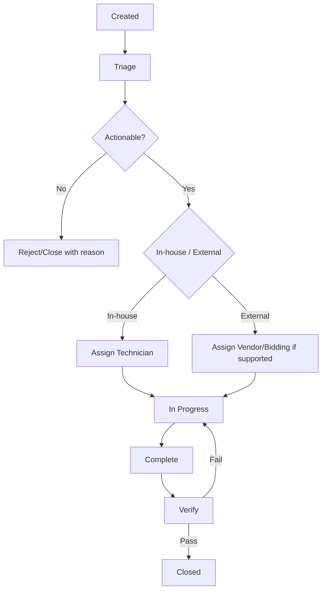
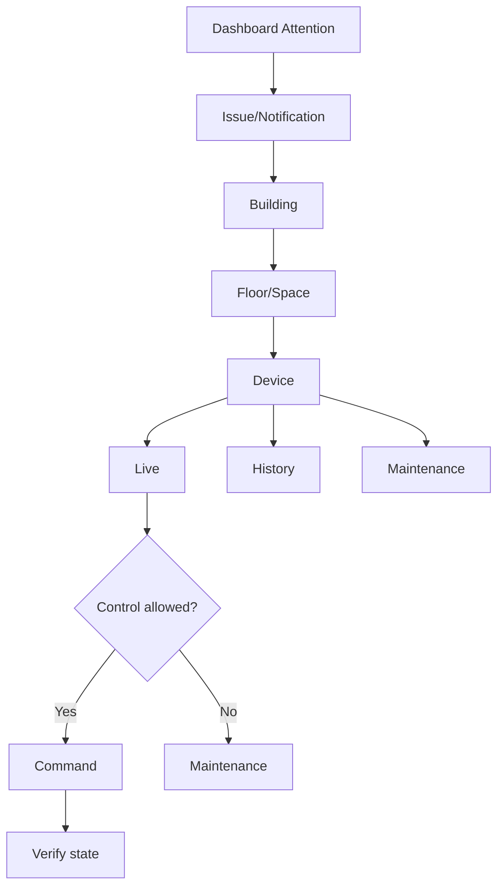
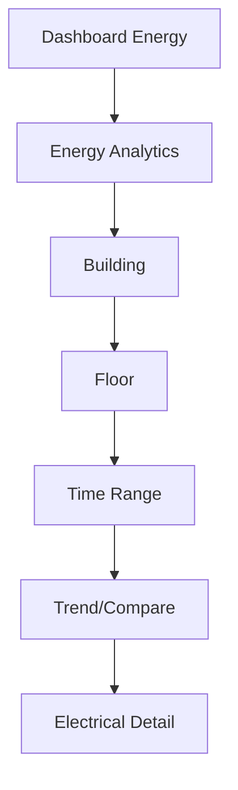
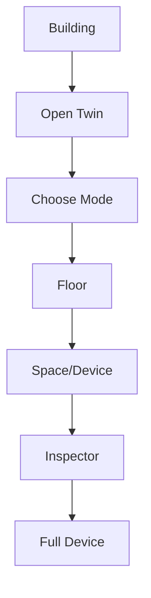
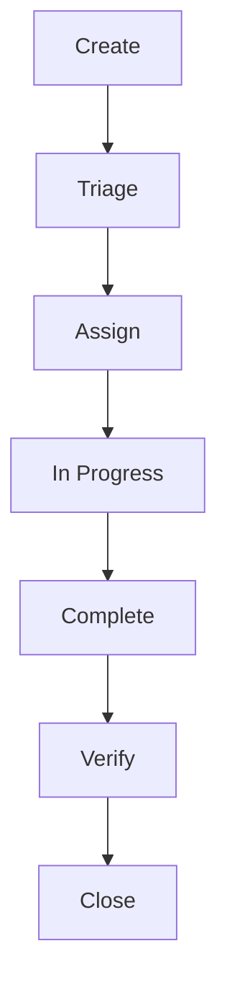
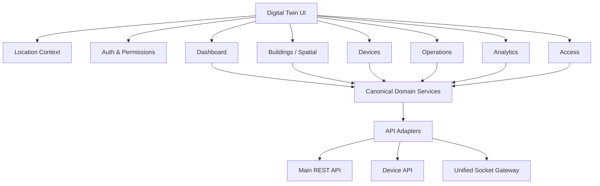

# Digital Twin Platform — Rewrite Master Blueprint, Workflows & Delivery Roadmap

**Document type:** Product + UX + technical rewrite specification  
**Purpose:** Single implementation blueprint for the Digital Twin platform revamp/rewrite  
**Current-state source:** `PROJECT_AUDIT_LOG.md` (audit dated 2026-09-02)  
**Design-system source:** `digital-twin-design-system.md`  
**Status:** Proposed target architecture based on the current application audit and benchmark synthesis

> **Discipline:** This document separates verified current behavior, target recommendations, and backend-dependent future capabilities. Missing devices can be added later through the capability-driven device framework defined here.


---

# LOCKED TECHNICAL IMPLEMENTATION — ANGULAR 22 SIGNAL-FIRST

This section is a **project-level implementation constraint** and supersedes older Angular 16 implementation patterns from the legacy application.

## Current Stable Angular Baseline

As of **2026-09-11**:

```text
Angular        22.1.6 stable
Angular CLI    22.1.6
TypeScript     >=6.0 <6.1
RxJS           ^7.4.0 supported
Node.js        ^22.22.3 || ^24.15.0 || ^26.0.0
Tailwind CSS   v4 — required by spartan/ui's Helm (styled) layer
@angular/cdk   required — spartan/ui Brain layer is built on CDK overlay/a11y primitives
@spartan-ng/brain + @spartan-ng/helm  full spartan/ui stack (behavior + prebuilt styled components)
SCSS           tokens/typography/resets only — component styling comes from Tailwind + Helm
```

`22.2.0-next.*` is pre-release and must not be used for production while the `next` tag remains pre-release.

When actual implementation begins, use the **latest stable Angular 22 patch/minor available on that date**, not an RC/next build. Let spartan.ng's own installer resolve the matching Tailwind/CDK versions rather than hand-picking them.

Recommended project creation:

```bash
npx @angular/cli@22.1.6 new digital-twin \
  --standalone \
  --routing \
  --style=scss \
  --strict
```

Then run `npx @spartan-ng/cli init` to add Tailwind CSS v4 and spartan/ui in one step. SCSS still owns `_tokens.scss`/`_typography.scss`/global resets; Tailwind utility classes (via Helm) own component-level styling.

### Using spartan/ui (Brain + Helm)

- **Brain** (`@spartan-ng/brain`) — accessible behavior: focus trapping, keyboard nav, ARIA state, overlay positioning. You never touch this code directly.
- **Helm** — the styled layer. The CLI *copies* component source into your repo (`shared/ui/button/`, `shared/ui/dialog/`, etc.), so you own it and restyle it with the DT design tokens (dark teal shell, Merik green, Satoshi 400/500, 8/12/14/16px radii) instead of the default shadcn look.

Generate components as you need them rather than up front: `ng g @spartan-ng/cli:ui dialog` (→ `DtModal`), `...popover`, `...select`, `...menu`, `...tabs`, `...tooltip`. Simple primitives with no real behavior (`DtBadge`, `DtStatusChip`, `DtDivider`, `DtSkeleton`) don't need spartan — hand-write those directly as Tailwind components.

## Application Architecture

The rewrite is locked to:

- **standalone-first**
- **signal-first**
- **zoneless**
- **strict TypeScript**
- **lazy-loaded routes**
- **functional providers/interceptors/guards where appropriate**
- **typed API contracts**
- **responsive-by-construction**
- **reusable component architecture**
- **design-token-driven styling**

Do **not** rebuild the legacy NgModule-heavy structure.

### Bootstrap

Target style:

```ts
bootstrapApplication(AppComponent, {
  providers: [
    provideRouter(routes),
    provideHttpClient(
      withInterceptors([
        authInterceptor,
        errorInterceptor,
      ]),
    ),
  ],
});
```

Angular 21+ is zoneless by default. Do not re-add ZoneJS unless a verified dependency makes it unavoidable.

---

# SIGNAL-FIRST STATE MODEL

## `signal()`

Use for local or writable state.

```ts
readonly sidebarOpen = signal(false);
readonly selectedBuildingId = signal<string | null>(null);
readonly selectedRange = signal<TimeRangePreset>('24h');
```

## `computed()`

Use for all derived state.

```ts
readonly selectedBuilding = computed(() =>
  this.buildings().find(
    b => b.id === this.selectedBuildingId()
  ) ?? null
);
```

Do not duplicate a value into another writable signal when it can be derived.

## `linkedSignal()`

Use for writable dependent state.

Typical DT cases:

- selected Floor depends on selected Building
- selected Space depends on selected Floor
- selected metric depends on supported device capabilities
- selected chart series depends on device type

## `httpResource()`

Use for reactive HTTP **reads** when request parameters come from signals.

Good uses:

- Dashboard widget data
- Building summary
- Device detail
- Device list query
- Telemetry query
- Maintenance list
- Notification list
- Role/user list

Example:

```ts
readonly deviceId = input.required<string>();

readonly deviceResource = httpResource<Device>(() =>
  `/api/devices/${this.deviceId()}`
);
```

Do **not** use `httpResource()` for mutations.

## `resource()`

Use when async work is not a simple HttpClient read.

Examples:

- composed multi-source initialization
- 3D scene metadata
- loading a model-manifest abstraction
- async calculation or adapter flow

## Mutations

Use typed services with `HttpClient` for:

```text
POST
PUT
PATCH
DELETE
device commands
file upload
schedule save
maintenance state transitions
user/role writes
```

Mutation state should still be represented with signals:

```text
idle
pending
success
error
```

## `effect()`

Use only for genuine side effects:

- localStorage/session persistence
- analytics logging
- imperative chart library bridge
- 3D renderer bridge
- browser APIs

Do not use `effect()` as a general state propagation mechanism.

## RxJS

RxJS remains required for stream-oriented work:

- Socket.IO/WebSocket
- reconnect/backoff
- debounce/search
- event streams
- complex cancellation/composition
- external libraries exposing Observables

Use Angular interop at boundaries:

```ts
toSignal()
toObservable()
takeUntilDestroyed()
```

Do not force WebSocket streams into a signal-only implementation.

---

# SIGNAL FORMS — DEFAULT FORM ARCHITECTURE

Angular 22 Signal Forms are the default for new forms.

Use for:

- Sign In
- Forgot/Reset Password
- Maintenance request
- User create/edit
- Role create/edit
- Schedule create/edit
- Device configuration
- complex filter forms

Pattern:

```ts
readonly model = signal({
  title: '',
  priority: 'medium',
  buildingId: '',
  floorId: '',
});

readonly maintenanceForm = form(this.model, p => {
  required(p.title);
  required(p.buildingId);
});
```

Reusable field controls should be designed to integrate naturally with Signal Forms.

Reactive Forms are allowed only when a required third-party integration still depends on CVA/Reactive Forms and the compatibility cost is lower than replacing that dependency.

Do not mix form architectures without a specific reason.

---

# REUSABLE COMPONENT ARCHITECTURE — LOCKED

Every UI element should belong to one of four layers.

## Layer 1 — Primitives

No domain knowledge.

```text
DtButton
DtIconButton
DtInput
DtNumberInput
DtSearchInput
DtSelect
DtMultiSelect
DtCheckbox
DtRadio
DtToggle
DtBadge
DtStatusChip
DtTooltip
DtPopover
DtModal
DtDrawer
DtTabs
DtSegmentedControl
DtSkeleton
DtEmptyState
DtErrorState
DtPagination
DtAvatar
DtMenu
DtDivider
```

Rules:

- reusable anywhere
- no API calls
- no route knowledge
- no building/device-specific assumptions
- signal inputs/outputs where appropriate
- styling only through design tokens/variants

## Layer 2 — Composite Components

Reusable application patterns.

```text
PageHeader
FilterBar
SearchFilterBar
DataTable
MetricCard
KpiCard
TrendCard
ChartCard
StatusSummary
DetailsList
Timeline
EntityHeader
LocationBreadcrumb
ContextSelector
NotificationItem
FileUploader
ConfirmActionDialog
```

Rules:

- may understand common application concepts
- never hardcode feature APIs
- accept typed inputs
- emit semantic events

## Layer 3 — Domain Components

Reusable across several screens inside the Digital Twin domain.

```text
DeviceStatus
DeviceIdentity
DeviceQuickView
DevicePropertyList
DeviceTelemetryChart
DeviceControlPanel
DeviceCapabilityTabs
BuildingStatus
FloorSelector
SpaceSelector
TwinInspector
TwinHierarchyTree
TwinDeviceMarker
MaintenanceStatus
MaintenanceTimeline
EnergySummary
EnvironmentSummary
AqiSummary
ConnectivitySummary
```

Rules:

- can understand DT domain types
- still should not own page routing or raw HTTP
- receive state from stores/facades
- usable in Dashboard, Building, Floor, Space and Detail views

## Layer 4 — Feature Pages

```text
DashboardPage
BuildingsPage
BuildingPage
FloorPage
SpacePage
TwinPage
DevicesPage
DevicePage
AnalyticsPage
MaintenancePage
NotificationsPage
UsersPage
RolesPage
```

Rules:

- compose reusable components
- connect to feature stores/facades
- handle route params
- orchestrate page-level actions
- no reusable visual implementation buried inside a page when it can be extracted

---

# COMPONENT API STANDARD

For new components, prefer signal APIs.

```ts
readonly device = input.required<Device>();
readonly compact = input(false);
readonly selected = model(false);
readonly open = output<string>();
```

A reusable component should:

- have typed inputs
- expose the smallest useful public API
- emit semantic actions (`deviceOpened`) rather than DOM-like implementation events
- avoid `any`
- avoid direct `HttpClient`
- avoid direct localStorage
- avoid parent-route assumptions
- avoid global mutable state
- support loading/empty/error/disabled variants where relevant
- be responsive inside its own container
- be keyboard accessible

---

# REUSABLE DATA TABLE

Build one DT table system rather than unique tables per module.

Capabilities:

```text
column definition
sorting
server/client pagination adapter
search
filters
selection
status cell
identity cell
row actions
loading rows
empty state
error state
responsive priority
sticky header
optional column visibility
```

Example:

```ts
interface DtTableColumn<T> {
  id: string;
  label: string;
  value: (row: T) => unknown;
  priority: 1 | 2 | 3;
  sortable?: boolean;
  width?: string;
  align?: 'start' | 'center' | 'end';
}
```

Device, Maintenance, Users, Roles and other list pages should use the same table foundation.

---

# REUSABLE CHART SYSTEM

Do not repeat chart setup inside each feature.

Build:

```text
DtTimeSeriesChart
DtMultiSeriesChart
DtBarChart
DtGauge
DtChartCard
DtChartTooltip
DtChartLegend
```

Each chart receives normalized `TimeSeries`.

Chart wrapper owns:

- ResizeObserver
- responsive axis density
- legend behavior
- loading/error/no-data
- tooltip
- export where supported
- missing-data rendering
- mobile interactions

The feature page only supplies data/config.

Use **one primary chart library** across the new application unless a specific visualization cannot be implemented reasonably with it.

---

# REUSABLE DEVICE RENDERING

Do not create:

```text
TemperatureComponent
HumidityComponent
GasComponent
AQIComponent
MotionComponent
...
```

as separate page architectures.

Use one generic device screen plus capability/domain renderers.

Example:

```text
DevicePage
 ├─ DeviceHeader
 ├─ DeviceStatusSummary
 ├─ DeviceProperties
 ├─ DeviceTelemetry
 ├─ DeviceControls       [if commands]
 ├─ DeviceEvents
 ├─ DeviceSchedule       [if scheduling]
 └─ DeviceConfiguration
```

Specialized visualization can be plugged in through a device renderer registry.

This is how future missing devices are added without redesigning the app.

---

# RESPONSIVE ARCHITECTURE — EVERY SCREEN + EVERY COMPONENT

Responsiveness is a Definition-of-Done requirement, not a later task.

## Target Widths

```text
Small Mobile      360–479px
Mobile            480–767px
Tablet            768–1023px
Small Desktop     1024–1279px
Desktop           1280–1439px
Large Desktop     1440–1919px
Ultra-wide        1920px+
```

Support below 360px gracefully where practical, but 360px is the minimum primary layout target.

## Responsive CSS Rules

Use:

- CSS Grid
- Flexbox
- `minmax()`
- `auto-fit` / `auto-fill` where appropriate
- `clamp()`
- container queries
- logical properties
- design tokens

Do not use Bootstrap grid.

Do not use user-agent/device sniffing.

## Container Queries

Reusable components should adapt to their actual parent width.

Tailwind v4 has `@container` utilities natively — mark a parent `@container` and use `@md:`-prefixed classes on children:

```html
<div class="@container">
  <div class="flex flex-col @md:flex-row gap-3">
    <span class="@md:hidden">compact label</span>
  </div>
</div>
```

Drop to raw CSS only for a one-off breakpoint value Tailwind's defaults don't cover:

```scss
.dt-widget {
  container-type: inline-size;
}

@container (max-width: 520px) {
  .dt-widget__secondary {
    display: none;
  }
}
```

This is critical because the same component may appear:

- in a 3-column Dashboard card
- in a 4-column Building panel
- inside a Drawer
- full-width on mobile

Viewport media queries alone are insufficient.

## Programmatic Breakpoints (TS side)

For layout decisions that can't be expressed in CSS alone — switching a table to a card list, swapping a side panel for a bottom sheet, collapsing the 3D inspector — use a small `matchMedia`-backed signal utility rather than Angular CDK's `BreakpointObserver` or a hand-rolled `window.resize` listener:

```ts
// shared/utils/media-query.signal.ts
export function mediaQuerySignal(query: string) {
  const mql = window.matchMedia(query);
  const state = signal(mql.matches);
  const listener = (e: MediaQueryListEvent) => state.set(e.matches);
  mql.addEventListener('change', listener);
  // pair with DestroyRef to remove the listener if used outside a component field initializer
  return state.asReadonly();
}
```

```ts
readonly isMobile = mediaQuerySignal('(max-width: 767px)');
```

Keep this to real structural changes (different component, not just different spacing) — pure visual responsiveness stays in Tailwind/CSS so it doesn't trigger change detection or re-render churn.

---

# RESPONSIVE APP SHELL

## ≥1440px

```text
Sidebar: 220px
Dashboard: 12-column
Full global search
Hierarchy + 3D + Inspector can coexist
```

## 1280–1439px

```text
Sidebar: 220px
12-column grid
Full tables
Slightly reduced content spans
```

## 1024–1279px

```text
Sidebar: 68px default/collapsible
8–12 column adaptive layout
Search may collapse
Secondary actions -> overflow
3D side panels collapsible
```

## 768–1023px

```text
Navigation: overlay drawer / rail
Main content: full width
Dashboard: 2 KPI cards per row
Filters: drawer
Tables: priority columns + horizontal scroll
3D: one side panel visible at a time
```

## 480–767px

```text
Navigation: drawer
Dashboard: 1 card per row generally
Tiny KPI pairs may be 2-column
Filters: bottom sheet/full screen
Forms: 1 column
Tabs: horizontal scroll
3D inspector: bottom sheet
```

## 360–479px

```text
Single column
16px page gutters
Compact top bar
Actions wrap/collapse
No fixed-width controls
Complex dialogs become full-screen
```

## ≥1920px

Do not stretch form/text content indefinitely.

Allow:

- wider charts
- more dashboard columns where valuable
- larger 3D canvas
- wider data tables

Use component/page-specific max widths rather than a single universal container width.

---

# RESPONSIVE PAGE RULES

## Page Header

Desktop:

```text
Breadcrumb
Title / Description                      Actions
```

Mobile:

```text
Breadcrumb
Title
Description
Primary Action       More
```

Never compress six actions into one mobile row.

## Dashboard

Desktop:
- 4 KPI cards when readable
- 8/4 or 7/5 major composition
- 6/6 secondary composition

Tablet:
- 2 KPIs per row
- major chart full width
- Attention full width or 2-column when container supports it

Mobile:
- important operational content first
- mostly 1-column cards
- 2-column only for compact metrics

Mobile priority order:

1. Attention Required
2. Critical device states
3. Primary KPIs
4. Maintenance
5. Energy
6. Environment/secondary analytics

Do not preserve desktop visual order when it hurts mobile task priority.

## Tables

### Desktop
Full table.

### Tablet
Hide low-priority columns; preserve identity/status/action.

### Mobile
Choose based on task:

**Reduced table** — identity/status/value/action.  
**Row card** — only where row comparison is not primary.  
**Horizontal table** — permission matrices and similar cross-column structures.

Do not turn every table into cards.

## Forms

Desktop:
- 1 or 2 columns
- paired fields only when related

Tablet:
- reduce to one column when required

Mobile:
- one column
- 100% control width
- sticky action bar for long forms where useful

## Tabs

- desktop: inline
- small screens: horizontally scrollable
- active tab always visible
- no wrapped/two-line tab labels

## Filters

Desktop:
- high-value filters inline
- advanced filters in drawer

Tablet/mobile:
- 1–2 key filters inline at most
- remainder in drawer/bottom sheet
- show active filter count

## Dialogs / Drawers

Desktop:
```text
Modal: 400 / 520 / 720px
Drawer: 420 / 520px
```

Tablet:
```text
Modal: up to 80–90vw
Drawer: up to ~70vw
```

Mobile:
- complex modal -> full-screen dialog
- contextual drawer -> bottom sheet or full-screen sheet
- confirmation can remain compact

## Charts

Every chart must:

- measure its actual container
- resize without page reload
- reduce x-axis tick density
- adapt legend placement
- support touch
- avoid unreadable labels
- maintain minimum plot height
- show data table/summary fallback where required for accessibility

## 3D Viewer

Desktop:
- hierarchy + scene + inspector

Tablet:
- scene + one collapsible side panel

Mobile:
- scene full width
- hierarchy as sheet
- inspector as bottom sheet
- simplified controls
- no tiny floating desktop panel layout

## Navigation

Do not make sidebar behavior depend on `/dashboard` versus other routes as in the legacy implementation. Responsive navigation behavior is based on available width.

---

# RESPONSIVE COMPONENT CONTRACT

Every reusable component must document:

```text
minimum usable width
preferred width
wrapping behavior
overflow behavior
touch behavior
keyboard behavior
mobile transformation
empty/error/loading behavior
```

No reusable component is approved if it only works in the Figma width where it was originally designed.

---

# RESPONSIVE TEST MATRIX

Every major page must be verified at:

```text
360 × 800
390 × 844
480 × 900
768 × 1024
1024 × 768
1280 × 800
1440 × 900
1920 × 1080
```

Also test:

- zoom 200%
- long labels
- long device names
- large numeric values
- empty states
- error states
- loading states
- 0 rows / 1 row / many rows
- many tabs
- large filter selections
- open drawer/modal
- 3D unavailable

Use Playwright visual screenshots for the critical viewport matrix.

---

# RESPONSIVE DEFINITION OF DONE

A screen/component is not done until:

- no unintended horizontal page scroll at target widths
- no clipped action
- no inaccessible menu
- no overlapping card
- no unreadable chart
- no overflowed KPI
- tables have an intentional small-screen strategy
- form fields remain usable
- modal/drawer controls remain reachable
- touch and keyboard paths work
- 200% browser zoom remains operable
- long content has been tested

---

# PROJECT FOLDER ARCHITECTURE

Recommended structure:

```text
src/app/
├── app.config.ts
├── app.routes.ts
├── core/
│   ├── auth/
│   ├── http/
│   ├── permissions/
│   ├── sockets/
│   ├── config/
│   └── observability/
├── shared/
│   ├── ui/                    ← spartan Helm output lives here, restyled with DT tokens
│   │   ├── button/            (ng g @spartan-ng/cli:ui button)
│   │   ├── input/              (ng g @spartan-ng/cli:ui input)
│   │   ├── select/              (ng g @spartan-ng/cli:ui select)
│   │   ├── dialog/               (ng g @spartan-ng/cli:ui dialog  -> DtModal)
│   │   ├── popover/               (ng g @spartan-ng/cli:ui popover)
│   │   ├── table/                  hand-written (DataTable composite, not a spartan primitive)
│   │   ├── chart/                   hand-written (thin wrapper over chart lib)
│   │   └── ...
│   ├── layout/
│   ├── pipes/
│   ├── directives/
│   ├── utils/
│   └── types/
├── domain/
│   ├── buildings/
│   ├── locations/
│   ├── devices/
│   ├── telemetry/
│   ├── maintenance/
│   ├── notifications/
│   └── access/
├── features/
│   ├── dashboard/
│   ├── buildings/
│   ├── devices/
│   ├── analytics/
│   ├── maintenance/
│   ├── schedules/
│   ├── notifications/
│   └── access/
└── styles/
    ├── _tokens.scss           ← CSS custom properties, consumed by @theme in tailwind
    ├── _typography.scss
    ├── _responsive.scss
    └── styles.scss

components.json                 ← spartan/ui CLI config (paths/aliases for `ng g @spartan-ng/cli:ui`)
tailwind.config.ts / @theme      ← Tailwind v4 theme, mapped to _tokens.scss custom properties
```

Map the DT design tokens into Tailwind's `@theme` block so both Tailwind utilities and hand-written SCSS read from one source of truth:

```css
@theme {
  --color-shell: #1B4143;
  --color-merik: #24B262;
  --color-merik-light: #4ADA89;
  --color-canvas: #F4F7F6;
  --radius-control: 8px;
  --radius-card: 12px;
}
```

## Dependency Direction

```text
features
  ↓
domain
  ↓
core

features
  ↓
shared

domain must not import features
shared must not import features
```

This prevents the cross-module coupling present in the legacy app.

---

# CODING STANDARDS

## Required

- strict typing
- `readonly` by default
- `inject()` consistently
- signals for component state
- computed derived values
- `takeUntilDestroyed()` for subscriptions
- native Angular control flow: `@if`, `@for`, `@switch`
- track expressions in `@for`
- typed route data
- functional interceptors
- no direct environment URL concatenation in features
- no `window.location.reload()` for state refresh
- no manual component construction with `new`
- no duplicated date/status/device inference utilities
- no component with hundreds of unrelated properties/methods

## Component Size Guideline

A page becoming very large is an architecture warning.

Split by responsibility:

```text
Page orchestration
Domain section
Reusable visual component
Store/facade
Adapter/service
```

Do not recreate 700–1000-line page components from the legacy project.

---

# PERFORMANCE RULES FOR SIGNAL APP

- use `computed()` instead of template method calls for derived collections
- use `@for (...; track entity.id)`
- do not clone large arrays unnecessarily
- virtualize genuinely large lists
- server paginate large device tables where possible
- lazy load feature routes
- lazy load 3D and heavy charts
- defer noncritical dashboard widgets when appropriate
- use container ResizeObserver only inside wrapper components that need it
- cache historical telemetry
- cancel obsolete data requests
- scope socket subscriptions to visible/needed entities

---

# REVISED IMPLEMENTATION GATE

Before feature development begins, confirm:

1. Angular 22 stable project scaffold is created.
2. Zoneless operation is verified.
3. Signal state conventions are documented.
4. Signal Forms wrappers are proven.
5. Responsive shell works from 360px to 1920px+.
6. Core reusable component library is implemented.
7. Data table works across all breakpoint classes.
8. Chart wrapper resizes by container.
9. Modal/drawer transforms correctly on mobile.
10. Twin viewer has responsive panel strategy.
11. API adapter layer is typed.
12. Socket gateway pattern is proven.
13. Device renderer registry supports unknown/new device types.

Only then should feature screens be built at scale.


---

# 1. Executive Summary

The current Digital Twin application has useful building, IoT, analytics, maintenance, notifications and access-management capabilities, but the implementation grew around individual endpoints and sensor components rather than one coherent product model.

The rewrite should converge on:

> **Organization / Portfolio → Building → Floor → Space → System → Device → Point / Property**

Four information layers sit on top of that hierarchy:

1. **Static context** — identity, location, type, relationships, files and configuration.
2. **Live state** — online/offline/stale, current readings and commands.
3. **Historical state** — telemetry, trends, comparisons and analytics.
4. **Operational work** — notifications, issues, maintenance, schedules and assignments.

The rewritten product should be organized around **context → problem → investigation → action → verification**, not around separate sensor dashboards.

---

# 2. Benchmark Synthesis

The following patterns are intentionally borrowed from leading digital-twin/building platforms:

| Platform | Pattern to Borrow |
|---|---|
| Willow | Location-scoped building home, customizable KPI/widget thinking, 3D issue context, static + spatial + live data |
| KODE OS | Device/system relationships and contextual device referencing |
| Autodesk Tandem | 3D + operational data + time navigation |
| Siemens Building X | Portfolio drilldown, live equipment operations, trends, events and work-order connection |
| Johnson Controls OpenBlue | Unified building-performance workspace |
| Akila | 3D overview/equipment/alarm modes and custom views |
| Spaceti | Floor-plan-first space/environment context |
| Facilio | Energy → anomaly → maintenance/action workflows |
| Clockworks | Prioritized actionable faults rather than raw alarm volume |
| Mapped | Vendor-agnostic normalized building data model |
| AWS IoT TwinMaker | Scene hierarchy, entity graph and spatial data overlays |
| Bentley iTwin | Role-based web twin navigation and spatial asset context |
| Schneider EcoStruxure | Multi-system monitoring/control and alarm/event handling |
| IBM Maximo | Structured maintenance/work-order lifecycle |
| BrainBox AI | HVAC/environment intelligence and portfolio control patterns |
| 75F | Environmental/occupancy context and remote building control patterns |
| NVIDIA Omniverse | Future advanced 3D/simulation direction |

Do not copy unverified scores, AI features, occupancy data, environmental metrics, predictive analytics or controls unless the Digital Twin backend/device layer can actually support them.

---

# 3. Verified Current Scope

The current audit verifies:

- Angular 16.2
- PrimeNG 16.9
- Bootstrap 5.3
- 86 components across 17 feature modules plus shell/shared
- REST + Socket.IO
- separate main and device API hosts
- hash routing
- `@google/model-viewer` for GLB/GLTF
- dashboard, buildings, spaces, devices, device settings, real-time data, analytics, maintenance, notifications, users and roles
- multiple energy/electrical analytics endpoints
- gas, AQI, motion and temperature/humidity integrations
- device property commands and smart-switch relay control
- schedule creation
- maintenance requests through `org/complain`

Current known device tiles include Temperature, Smart Switch, Smoke, Energy, Gas, Hub, Contact, Humidity, AQI, Motion and Water Leak. Several are mock/dummy-backed in the existing UI; mock status must not be treated as live production functionality in the rewrite.

---

# 4. Product Principles

1. **Location context is global.**
2. **UI is capability-driven.**
3. **Live data always communicates freshness.**
4. **Problems are prioritized, not just counted.**
5. **3D is contextual, not decorative.**
6. **Tables remain first-class for dense operations.**
7. **All device types use one extensible device model.**
8. **All telemetry uses one time-series model.**
9. **Operational events should connect to action.**
10. **No invented product logic.**
11. **No hardcoded production device/building/floor IDs.**
12. **No production mock data.**

---

# 5. Product Personas

These are product personas, not hardcoded backend roles.

## Organization Administrator
Portfolio visibility, user/role access, configuration, device oversight.

## Facility / Building Manager
Building status, issues, energy/environment, maintenance and spatial investigation.

## Operations Engineer
Live equipment state, telemetry, trends, commands and schedules.

## Maintenance Coordinator / Technician
Requests, priority, location/device context, attachments, assignment and completion.

## Energy / Analytics User
Energy/electrical trends, building/floor comparisons, exports.

## Viewer / Stakeholder
Read-only dashboards and approved operational information.

---

# 6. Target Information Architecture

## Sidebar

### Overview
- Dashboard

### Portfolio
- Buildings
- Spaces

### Operations
- Devices
- Issues / Alerts *(when backend exists)*
- Maintenance
- Schedules

### Intelligence
- Analytics

### Administration
- Users
- Roles
- Settings / Integrations *(future)*

### Utility
- Notifications in top bar + full page
- Profile / Sign out

## Consolidations

- `Real-Time Data` → Device Detail + Analytics
- `Device Settings` → Devices
- `Building Management` → Buildings
- `Role Management` + `User Management` → Administration / Access
- Space Management remains global only if cross-building space work is truly needed

---

# 7. Proposed Route Architecture

```text
/auth/sign-in
/auth/forgot-password
/auth/check-email
/auth/reset-password

/dashboard

/buildings
/buildings/:buildingId
/buildings/:buildingId/floors/:floorId
/buildings/:buildingId/floors/:floorId/spaces/:spaceId
/buildings/:buildingId/twin

/spaces
/spaces/:spaceId

/devices
/devices/:deviceId

/operations/issues
/operations/issues/:issueId
/operations/maintenance
/operations/maintenance/:maintenanceId
/operations/maintenance/new
/operations/schedules
/operations/schedules/:scheduleId

/analytics
/analytics/energy
/analytics/electrical
/analytics/environment
/analytics/aqi
/analytics/devices

/notifications

/access/users
/access/users/new
/access/users/:userId
/access/roles
/access/roles/new
/access/roles/:roleId

/settings
/no-permissions
```

### Legacy Redirects

```text
/space-management      -> /spaces
/device-management     -> /devices
/device-setting        -> /devices
/real-time-data        -> /analytics
/maintenance           -> /operations/maintenance
/role-management       -> /access/roles
/user-management       -> /access/users
/building-management   -> /buildings
```

---

# 8. Global Shell

## Sidebar
Use approved design system: 220px expanded, 68px collapsed, dark teal `#1B4143`, Satoshi 14/500, active icon `#4ADA89`, optional Merik indicator `#24B262`.

## Top Bar
Contains only global tools:

- location scope selector
- global search
- notifications
- profile/account
- optional help

## Global Location Context

```text
Portfolio
  └─ Building
      └─ Floor
          └─ Space
```

Scope persists while navigating between Dashboard, Analytics, Devices and Maintenance where possible.

## Global Search
Searchable target entities:

- building
- floor
- space
- device name
- device ID

Future: maintenance, issue, user.

---

# 9. Target Domain Model



Operational entities:

```text
Notification
Issue / Alert
Maintenance Request
Work Order (future)
Schedule
Rule / Threshold (future)
User
Role
Permission
File / Document
3D Scene / Model
```

Future relationship types should support generic edges such as:

```text
feeds / isFedBy
meters / isMeteredBy
contains / locatedIn
controls / isControlledBy
connectedTo
gatewayFor
```

---

# 10. Canonical Frontend Contracts

```ts
interface LocationRef {
  organizationId?: string;
  buildingId?: string;
  floorId?: string;
  spaceId?: string;
}

type DeviceConnectivityStatus =
  | 'online'
  | 'offline'
  | 'stale'
  | 'warning'
  | 'error'
  | 'disabled'
  | 'unknown';

interface DeviceCapabilities {
  telemetry: boolean;
  commands: boolean;
  scheduling: boolean;
  thresholds: boolean;
  battery?: boolean;
  signal?: boolean;
  environment?: boolean;
  energy?: boolean;
  occupancy?: boolean;
}

interface DeviceProperty {
  id: string;
  key: string;
  label: string;
  value: string | number | boolean | null;
  unit?: string;
  valueType: 'number' | 'boolean' | 'string' | 'enum';
  writable: boolean;
  updatedAt?: string;
  quality?: 'good' | 'stale' | 'bad' | 'unknown';
  min?: number;
  max?: number;
}

interface TimeSeriesPoint {
  timestamp: string;
  value: number | null;
  quality?: 'good' | 'missing' | 'stale' | 'bad';
}

interface TimeSeries {
  metric: string;
  unit?: string;
  deviceId?: string;
  points: TimeSeriesPoint[];
}
```

The legacy API adapter maps current endpoint shapes onto these contracts.

---

# 11. Device Architecture

The rewrite must replace hardcoded device-specific modules with a registry + capability model.

## Initial Categories

```text
environment
energy-meter
gas
air-quality
motion
contact
smoke
water-leak
switch
gateway-hub
generic-sensor
generic-actuator
unknown
```

## Current Coverage Matrix

| Device | Category | Telemetry | Control | Schedule | Current Caveat |
|---|---|---:|---:|---:|---|
| Temperature | environment | Yes | No by default | No | Often paired with humidity |
| Humidity | environment | Yes | No by default | No | Conditional |
| AQI | air-quality | Yes | No | No | Endpoint normalization required |
| Gas | gas | Yes | No | No | Current CO/CO2 |
| Motion | motion | Yes | No | No | Event-oriented |
| Contact | contact | Mock/partial | Depends | No | Real API required |
| Smoke | smoke | Dummy tile | No | No | Backend required |
| Energy | energy-meter | Yes | No | No | Multi-metric |
| Smart Switch | switch | Partial | Yes | Yes where supported | Commandable |
| Hub | gateway-hub | Dummy tile | No | No | Backend required |
| Water Leak | water-leak | Tile exists | No | No | Backend details required |

## Unknown/Future Device Fallback

An unknown device should still render:

- generic icon
- name/type
- location
- connectivity state
- raw safe properties
- numeric telemetry if supplied
- controls only for `writable=true`

Never guess units, thresholds or capabilities.

---

# 12. Telemetry Freshness

Every live metric should model:

```text
value
unit
timestamp
freshness
quality
source
```

Suggested display states:

- Live
- Stale
- Offline
- Unknown
- Error
- No Data

Freshness threshold should come from device metadata where available, not one hardcoded timeout.

---

# 13. Unified Time Range Model

Standard range vocabulary:

```text
Live
6 Hours
12 Hours
24 Hours
7 Days
30 Days
6 Months
Custom
```

Canonical form:

```ts
interface TimeRange {
  preset?: 'live'|'6h'|'12h'|'24h'|'7d'|'30d'|'6m';
  from: string;
  to: string;
  timezone: string;
  granularity: 'raw'|'minute'|'hour'|'day'|'month';
}
```

Missing telemetry must be `null` unless zero is a genuine measured value. Do not automatically transform all gaps into zero.

---

# 14. Adaptive Dashboard

There should be one Dashboard whose content adapts to selected scope.

## Portfolio Scope

### KPI Strip
Use real data only:

- Buildings
- Device connectivity
- Energy
- Maintenance

### Main Sections
- Portfolio/building status
- Attention Required
- Energy Trend
- Building Performance List
- conditional Environment/AQI summary

## Building Scope

Recommended layout:

```text
┌──────────────────────────────┬───────────────┐
│ Building / 3D Overview       │ Attention     │
│                              │ Required      │
├───────────────┬──────────────┼───────────────┤
│ Device Health │ Energy       │ Maintenance   │
├───────────────┴──────────────┼───────────────┤
│ Energy Trend                 │ Environment   │
├──────────────────────────────┴───────────────┤
│ Floors / Spaces / Recent Activity           │
└──────────────────────────────────────────────┘
```

### Building/3D Overview
If model exists:

- model
- floor selection
- real issue markers
- device markers
- quick device drawer

If no model exists, use building summary/floor list instead of an empty 3D frame.

### Device Health
Online / Offline / Stale / Unknown.

### Environment
Show only supported sensors.

### No Fake Score Rule
Do not invent Building Health/Comfort/Impact scores without approved formulas.

---

# 15. Floor Workflow

Entry points:

- Building → Floors
- click 3D floor
- global search
- maintenance/issue location link

Floor page contains:

- building/floor header
- 2D floor plan or floor 3D model
- spaces
- device markers
- operational markers
- conditional environmental overlay
- conditional energy summary



---

# 16. Space Workflow

Space page:

- breadcrumb
- space identity
- device count
- current state
- current supported environmental values
- devices
- controls
- schedules if supported
- events/maintenance
- historical trends

Controls must always identify the device/property being changed.

---

# 17. Digital Twin / 3D Viewer

Target layout:

```text
┌───────────────────────────────────────────────────────┐
│ Breadcrumb / Scope       Search        View controls  │
├───────────────┬──────────────────────────┬────────────┤
│ Hierarchy     │                          │ Inspector  │
│ Building      │        3D Scene          │            │
│ Floor         │                          │            │
│ Space         │                          │            │
│ Devices       │                          │            │
└───────────────┴──────────────────────────┴────────────┘
```

Initial viewer modes:

- Overview
- Devices
- Issues
- Environment when supported

Future:

- energy
- maintenance
- relationships
- historical time navigation

3D selection inspector:

```text
Name
Type
Location
State
Key live values
Last update
Related device/system
Open full detail
```

Performance:

- lazy-load viewer
- load only required models
- optimize GLB
- maintain non-3D fallback
- remove unused legacy models from production bundle

---

# 18. Devices Module

Consolidates Device Management + Device Setting + live device portions of Real-Time Data.

## Device List

Filters:

- search
- building
- floor
- space
- type
- connectivity
- capabilities

Columns:

```text
Device
Device ID
Type
Location
Status
Key Reading
Last Seen
Actions
```

## Device Quick Drawer

- identity
- location
- status
- last seen
- 2–4 key readings
- active issue
- open full device

## Device Detail Tabs

Capability-driven:

```text
Overview
Telemetry
Controls
Events
Schedule
Configuration
Relationships (future)
```

No unsupported tab should be visible.

---

# 19. Device Command Workflow



Optimistic UI is not hardware confirmation.

---

# 20. Schedules

## List
Schedule, devices, location, days, next run, status, actions.

## Create/Edit
1. Name
2. Scope/device selection
3. Weekly blocks
4. End date/no expiry
5. Review
6. Save

Support current half-hour concept initially if backend requires it.

Add:

- copy day
- clear day
- apply weekdays
- timezone
- conflict state

Block save when no devices, no time blocks, invalid end date or unsupported device is selected.

---

# 21. Analytics

One shared analytics shell:

```text
Scope
Metric
Time range
Comparison
Chart
Summary statistics
Data quality / Last update
Export
```

## Analytics Home
- Energy
- Electrical
- Environment
- AQI
- Device Health
- Maintenance analytics later

## Energy
- selected-period consumption
- building/floor breakdown
- comparison
- trends

## Electrical
Current data suggests support for:

- voltage
- current
- frequency
- power factor
- active power
- reactive power
- apparent power
- energy

Multi-phase series appear only when supplied.

## Environment
Potentially temperature, humidity, CO, CO2 and future real metrics.

## AQI
Potentially AQI index, temperature, humidity, TVOC, eCO2, PM1, PM2.5, PM10 if the selected device actually returns them.

AQI thresholds/classification must be centralized after the governing standard is approved.

---

# 22. Motion, Contact, Smoke and Leak

## Motion
Current state, last detection, detection count, timeline.

## Contact
Open / Closed / Unknown. Remove static mock behavior when real API is unavailable.

## Smoke
Do not show a dummy smoke sensor as operational. When supported: alarm, device health, last test, events.

## Water Leak
Normal/leak, last event, location, device health, maintenance link.

---

# 23. Issues / Alerts

Formal Issue module is backend-dependent.

Proposed issue fields:

```text
id
title
type
severity
status
source
location
device
metric
observed value
threshold
detected at
last seen
acknowledged by
related maintenance/work order
resolution
```

Lifecycle:



---

# 24. Maintenance

Use current `org/complain` initially as Maintenance Request source.

## Maintenance List

Filters:

- status
- priority
- building
- floor
- space
- category
- source
- date
- search

Columns:

```text
Request
Location
Priority
Status
Category
Assigned
Created
Updated
```

## Maintenance Detail

- title/status/priority
- location
- description
- attachments
- requester
- related device
- assignment
- timeline
- actions

## Target Lifecycle



Vendor/bidding is currently substantially mock-backed, so treat it as a backend workstream.

## Create Request

Required target fields:

- title
- description
- building
- floor
- space if applicable
- priority
- category/type

Optional:

- device
- contact
- attachments

Launching from a building/space/device should prefill context.

---

# 25. Notifications

## Top Bar
- unread count
- latest items
- optional type/date filter
- mark all read
- view all

## Full Page
- All / Unread
- type
- date
- location
- Today / Yesterday / Earlier grouping

Notification should deep-link to its building/device/maintenance record whenever identifiers exist.

---

# 26. Users and Roles

## Users

List:

```text
User
Email
Role
Building Scope
Status
Actions
```

Create/edit:

- identity
- role
- building scope
- floor scope if supported
- profile image
- status

Remove hardcoded Resident/Tenant/Owner filters unless real backend data requires them.

## Roles

Backend currently uses `create:`, `get:`, `update:`, `delete:`.

UI labels:

```text
View
Create
Edit
Delete
```

One centralized permission service, guard and public-route definition.

Backend authorization remains authoritative.

---

# 27. Authentication

Requirements:

- one AuthService
- one session store
- one expiry implementation
- one logout implementation
- one public-route configuration
- preserve remembered email separately
- support return URL after successful login

If backend changes are possible, prefer safer server-managed sessions/cookies. If not, centralize JWT browser storage access.

---

# 28. Dashboard Customization

Phase later than core rewrite.

## P1
Fixed approved dashboard.

## P2
- add widget
- hide widget
- reorder
- settings
- reset default
- persist per user/scope

Do not start with a generic dashboard builder.

---

# 29. State Management

Recommended global stores:

- `AuthStore`
- `ContextStore`
- `ShellStore`
- `NotificationStore`

Feature stores/facades:

- Buildings
- Devices
- Analytics
- Maintenance

Use Angular signals + RxJS intentionally. Avoid a heavyweight global state library unless the final application complexity justifies it.

Feature components should not parse localStorage directly.

---

# 30. Data Access Architecture

```text
UI
  ↓
Feature Facade/Store
  ↓
Domain Service
  ↓
Legacy/Future API Adapter
  ↓
ApiClient
  ↓
HTTP / Socket
```

`ApiClient` must provide:

- normalized URL joining
- typed methods
- standard errors
- auth
- timeout
- cancellation
- upload support

Components must not know whether current energy requires `org/eSensor-data-summary`, `org/energy-meter` or a date-in-path endpoint.

---

# 31. Domain Services

```text
AuthService
PermissionService
LocationContextService
BuildingService
SpaceService
DeviceService
DeviceCommandService
TelemetryService
EnergyService
EnvironmentService
AqiService
ScheduleService
MaintenanceService
NotificationService
UserService
RoleService
FileService
TwinSceneService
WeatherService
SocketGateway
```

No duplicate "helper" services for the same backend resource.

---

# 32. Socket Architecture

Replace hardcoded single-device socket services with one `SocketGateway`.

Responsibilities:

- connect/disconnect
- reconnect/backoff
- connection state
- subscribe/unsubscribe by device/topic
- subscription deduplication
- auth
- heartbeat
- event ordering
- cleanup

Example:

```ts
socketGateway.deviceUpdates(deviceId)
```

Rules:

- no hardcoded device IDs
- one connection per host where possible
- destroy subscriptions
- do not overwrite newer data with older socket events
- expose reconnecting/degraded live status

---

# 33. Weather

- one weather service
- rotate/remove leaked key
- secure key on server/config
- cache by building coordinates
- weather is contextual, not a primary building KPI
- no weather when valid location is unavailable

---

# 34. UI State Model

Every API-driven feature supports:

```text
idle
loading
success
empty
error
```

Live features additionally support:

```text
stale
disconnected
reconnecting
```

Partial failure rule: one failed widget must not blank the page.

Capability unavailable must be distinct from API failure.

Examples:

- "Required sensor not installed"
- "No readings for this period"
- "Unable to retrieve telemetry"
- "Stale · Last reading 2h ago"

---

# 35. Design System Contract

Use the approved DT design system:

```text
Typeface         Satoshi
Weights          400 / 500 only
Merik Primary    #24B262
Merik Light      #4ADA89
Canvas           #F4F7F6
Shell            #1B4143
Dark Feature     #102826
Control Radius   8px
Card Radius      12px
Large Card       14px
Feature Card     16px
Dashboard Gap    14px
```

No font weight above 500.

---

# 36. Core Component Library

Build before feature pages.

### Shell
AppSidebar, SidebarItem, TopBar, ContextSelector, Breadcrumbs, PageTabs.

### Actions
Button, IconButton, OverflowMenu.

### Forms
Input, NumberInput, Search, Select, MultiSelect, DatePicker, DateRange, Checkbox, Radio, Toggle, FileUpload.

### Data
DataTable, Pagination, StatusChip, EmptyState, ErrorState, Skeleton.

### Dashboard
KpiCard, TrendCard, MetricCard, IssueListWidget, WidgetFrame.

### Charts
TimeSeriesChart, MultiSeriesChart, BarChart, bounded Gauge.

### Spatial
BuildingCard, FloorCard, SpaceCard, FloorPlan, TwinViewer, TwinInspector, DeviceMarker.

### Overlay
Drawer, Modal, Popover, Tooltip, Toast.

---

# 37. Responsive + Accessibility

Breakpoints:

```text
XL        ≥1440
Desktop   1200–1439
Tablet    768–1199
Mobile    <768
```

Desktop is primary.

Accessibility minimum:

- WCAG AA contrast
- visible focus
- keyboard navigation
- status text + color
- accessible icon labels
- form labels
- reduced motion
- accessible chart summaries where practical

---

# 38. Security Requirements

## Immediate
1. Rotate leaked third-party weather key.
2. Remove secrets from deployable source/config.
3. Correct production environment behavior.
4. Confirm correct REST/socket hosts.
5. Move to HTTPS/real hostnames.

## Rewrite
- centralized auth
- server-enforced authorization
- command auditing
- socket auth
- secure upload validation
- CSP
- sanitization
- no sensitive console logs
- CSRF defense if cookies adopted
- no raw backend error leakage

---

# 39. Audit Trail

Device-changing actions should record where backend support exists:

```text
actor
device
property
old value
requested value
result
timestamp
correlation ID
```

Maintenance state/assignment changes should also be auditable.

---

# 40. Observability

Track:

- API error rate/latency
- socket connection/reconnect
- stale-device count
- command success/failure
- 3D load failures
- uncaught frontend errors
- route load time
- chart/data failures

Product analytics events may include:

```text
building_opened
device_opened
device_command_submitted
maintenance_created
maintenance_status_changed
analytics_range_changed
notification_opened
```

Avoid logging private telemetry values unnecessarily.

---

# 41. Performance

- lazy-load feature routes
- lazy-load 3D
- remove dead chart/component code
- standardize chart library
- optimize GLB/textures
- remove unused 3D models from production
- backend pagination for large fleets
- stable list keys
- downsample long telemetry ranges
- cancel superseded requests
- cache historical ranges

---

# 42. Current → Target Migration Matrix

| Current | Target | Decision |
|---|---|---|
| Dashboard | Dashboard | Rebuild |
| Buildings | Buildings / Twin | Rebuild |
| Building Management | Buildings | Consolidate |
| Space Management | Buildings/Spaces | Consolidate |
| Device Management | Devices | Consolidate |
| Device Setting | Devices | Consolidate |
| Real-Time Data | Device/Analytics | Remove standalone nav |
| Analytics | Analytics | Rebuild common shell |
| Maintenance | Operations/Maintenance | Rebuild |
| Vendors/Bidding | Maintenance subflow | Backend-dependent |
| Notifications | Notifications | Rebuild/deep-link |
| User Management | Access/Users | Rebuild |
| Role Management | Access/Roles | Rebuild |
| Energy Dashboard orphan | Analytics/Energy | Delete old implementation |
| Phase Data orphan | Shared analytics | Delete |
| Dashboard mock notifications | Notifications | Delete |
| Empty atomic components | Design system | Replace |

---

# 43. Backend Contract Gaps

Resolve before declaring feature completion:

1. Organization/building/floor/space schemas
2. building CRUD
3. space CRUD
4. final device list
5. capability metadata
6. connectivity status vocabulary
7. freshness/update intervals
8. AQI endpoint/schema
9. temperature/humidity addressing
10. gas schema
11. motion schema
12. contact API
13. smoke API
14. water-leak API
15. hub/gateway API
16. command response/confirmation
17. schedule update/delete
18. maintenance status vocabulary
19. vendor persistence
20. work-order model
21. formal issue/alert API
22. threshold/rule API
23. model-to-building/floor mapping
24. notification deep-link identifiers
25. user scope/role contract
26. production auth/session strategy
27. socket subscription protocol
28. emergency/SOS behavior

---

# 44. Screen Inventory

## Auth
1. Sign In
2. Forgot Password
3. Check Email
4. Reset Password

## Dashboard
5. Adaptive Dashboard

## Buildings
6. Buildings List
7. Building Overview
8. Floor Detail
9. Space Detail
10. Digital Twin Viewer

## Devices
11. Devices List
12. Device Detail
13. Device Configuration tab

## Operations
14. Issues List — backend-dependent
15. Issue Detail — backend-dependent
16. Maintenance List
17. Maintenance Detail
18. New Maintenance
19. Schedules List
20. Schedule Create/Edit

## Analytics
21. Analytics Overview
22. Energy
23. Electrical
24. Environment
25. AQI
26. Device Health

## Notifications
27. Notifications History

## Access
28. Users List
29. User Create/Edit
30. Roles List
31. Role Create/Edit

## Future Administration
32. Settings/Integrations
33. Building Create/Edit
34. Device/Data Onboarding
35. Rules/Thresholds

Where practical, details/configuration should use tabs and drawers instead of unnecessary new routes.

---

# 45. Critical Journeys

## Building Problem



## Energy



## Spatial



## Maintenance



---

# 46. Definition of Done — Screen

A screen is complete only when:

- approved design implemented
- responsive behavior
- loading
- empty
- error
- permission state
- real API integration
- no production mock data
- no hardcoded production IDs
- accessibility reviewed
- tests pass
- QA pass
- no console errors
- documentation updated

---

# 47. Definition of Done — Device Type

A device type is complete only when:

- backend type confirmed
- category mapped
- icon mapped
- capability flags confirmed
- summary metrics defined
- units confirmed
- status vocabulary confirmed
- freshness interval confirmed
- detail metrics defined
- control schema confirmed
- telemetry history confirmed/absent
- error/empty states
- fixture
- production sample validation

---

# 48. Migration Strategy

Use a strangler-style migration.

1. Freeze contracts.
2. Build canonical adapters.
3. Build new design system/shell.
4. Replace routes progressively.
5. Keep legacy redirects.
6. Remove old route/module only after parity QA.

Suggested feature replacement order:

```text
Auth/Shell
Dashboard
Buildings/Twin
Devices
Analytics
Maintenance
Notifications
Access
```

---

# 49. Delivery Roadmap

Calendar duration cannot be credible until team size and backend scope are known. The phases below are the implementation sequence.

## Phase 0 — Security + Contract Freeze
- rotate key
- production config
- endpoint contract
- device inventory
- capability matrix
- permissions
- maintenance states
- mock-vs-real map

**Gate:** P0 integrations are understood.

## Phase 1 — Foundations
- tokens/components
- shell
- context selector
- forms/table/overlay
- routing
- auth/permissions
- ApiClient

**Gate:** approved components can build full static screens without one-off styles.

## Phase 2 — Data Foundation
- canonical types
- building/device/telemetry adapters
- maintenance/notification/access adapters
- socket gateway
- date/time
- standard errors/cache

**Gate:** components no longer call raw endpoints.

## Phase 3 — Dashboard
- portfolio scope
- building scope
- KPI framework
- attention
- energy
- device health
- maintenance
- conditional environment
- scope propagation

**Gate:** no hardcoded building/device IDs.

## Phase 4 — Buildings + Spatial
- list
- building
- floor
- space
- twin viewer
- model fallback
- markers/context

**Gate:** portfolio → device spatial navigation works.

## Phase 5 — Devices + Controls + Schedules
- device table
- drawer
- detail
- generic property renderer
- live updates
- commands
- scheduling
- unknown-device fallback

**Gate:** new supported device does not require a new feature module.

## Phase 6 — Analytics
- analytics home
- energy
- electrical
- environment
- AQI
- device health
- common ranges/charts/export

**Gate:** duplicated date/chart logic removed.

## Phase 7 — Operations
- maintenance
- notifications
- deep links
- issues only when backend exists
- vendor/bidding only when backend exists

**Gate:** operational data has an action workflow.

## Phase 8 — Access
- users
- roles
- permission matrix
- route/action authorization

**Gate:** one permission source controls navigation/routes/actions.

## Phase 9 — Hardening
- E2E
- accessibility
- performance
- security
- browser QA
- legacy redirects
- monitoring
- dead-code/assets removal
- UAT

**Gate:** production release candidate.

---

# 50. Example Sprint Baseline

Not a commitment; assumes a cross-functional team and available backend support.

| Sprint | Focus |
|---|---|
| 0 | Security, contracts, IA |
| 1 | Design system, shell, auth |
| 2 | Adapters, stores, socket |
| 3 | Dashboard |
| 4 | Buildings / Floor / Space |
| 5 | 3D + Devices |
| 6 | Controls + Schedules |
| 7 | Analytics |
| 8 | Maintenance + Notifications |
| 9 | Access + hardening/UAT |

---

# 51. Priority Backlog

## P0
- secret rotation
- production config
- auth consolidation
- permission consolidation
- URL normalization
- no hardcoded IDs
- canonical device model
- canonical telemetry
- socket gateway
- loading/error states

## P1
- dashboard
- buildings/floors/spaces
- 3D
- devices
- controls
- schedules
- analytics
- maintenance
- notifications
- users/roles

## P2
- dashboard customization
- issue module
- work orders
- relationships UI
- rules/thresholds
- benchmarking
- advanced spatial overlays
- document management

## P3
- FDD/root cause
- predictive maintenance
- AI assistant
- autonomous optimization
- 3D time navigation
- simulation
- impact/cost scoring

---

# 52. Do Not Build First

Do not start with:

- AI/copilot
- simulation
- fancy 3D animation
- dashboard builder
- predictive maintenance
- impact score
- rules builder
- vendor marketplace
- large settings suite

The data/domain foundation must exist first.

---

# 53. External Reference Links

- Willow Building Home: https://support.willowinc.com/hc/en-us/articles/10861459429775-The-New-Building-Home-Page
- Willow Platform: https://willowinc.com/willow-platform/
- Willow Digital Twin: https://willowinc.com/willow-digital-twin/
- Willow Knowledge Graph: https://willowinc.com/knowledge-graph/
- KODE OS Device Referencing: https://help.kodelabs.com/portal/en/kb/articles/device-referencing-in-kode-os
- Autodesk Tandem Features: https://intandem.autodesk.com/features/
- Autodesk Tandem Learning: https://www.autodesk.com/learn/ondemand/collection/get-started-with-digital-twins-in-tandem
- Siemens Operations Manager: https://www.siemens.com/en-us/products/building-x/applications/operations-manager/
- Siemens Energy Manager: https://www.siemens.com/en-us/products/building-x/applications/energy-manager/
- Siemens Data Visualizer: https://www.siemens.com/en-us/products/building-x/applications/data-visualizer/
- Johnson Controls OpenBlue: https://www.johnsoncontrols.com/openblue
- Akila Platform: https://www.akila3d.com/product/
- Akila 3D Manual: https://user-manual.akila3d.com/web/dt/dt/
- Facilio Connected Buildings: https://facilio.com/product/connected-buildings/
- Clockworks FDD: https://go.clockworksanalytics.com/building-fault-detection-and-diagnostics
- Mapped Platform: https://www.mapped.com/platform
- AWS IoT TwinMaker: https://docs.aws.amazon.com/iot-twinmaker/latest/guide/what-is-twinmaker.html
- AWS TwinMaker Scenes: https://docs.aws.amazon.com/iot-twinmaker/latest/guide/scenes.html
- Bentley iTwin Experience: https://www.bentley.com/en/products/itwin-experience/
- Schneider EcoStruxure Building Operation: https://www.se.com/us/en/product-range/62111-ecostruxure-building-operation-software/
- BrainBox AI: https://brainboxai.com/en/
- 75F IAQ: https://www.75f.io/applications/indoor-air-quality-management/
- NVIDIA Omniverse: https://docs.omniverse.nvidia.com/enterprise/latest/
- IBM Maximo Work Orders: https://www.ibm.com/docs/en/masv-and-l/maximo-manage/cd?topic=overview-work-orders

---

# 54. Phase-0 Open Decisions

1. Frontend-only or backend contract changes allowed?
2. Final production device inventory?
3. Which dummy tiles receive real APIs?
4. Exact Online/Offline semantics?
5. Stale interval per device?
6. Formal alert API?
7. Complaint vs work-order future model?
8. Vendor/bidding persistence?
9. Real spaces CRUD?
10. Buildings CRUD?
11. 3D model assignment model?
12. Command confirmation rules?
13. Emergency/SOS real or remove?
14. Authoritative permission vocabulary?
15. Final production hosts?
16. Session/JWT strategy?
17. Guaranteed energy device metrics?
18. AQI standard?
19. Device command confirmation behavior?
20. Final production personas/scopes?

---

# 55. Final Architecture



The rewritten UI should be organized around **places, assets, live state, history and action**, not the implementation history of individual endpoints.

---

# 56. Final Build Rules

1. No production mock data.
2. No hardcoded production IDs.
3. No hardcoded single-device socket services.
4. No metric without capability/data.
5. No environment card without relevant sensors.
6. No health score without formula.
7. No "live" value without freshness.
8. No device control without permission + feedback + verification.
9. No duplicated route/auth/permission logic.
10. No raw endpoints in feature components.
11. No duplicate date/chart logic.
12. Satoshi 400/500 only.
13. Use approved design tokens/components.
14. Every major workflow includes loading/empty/error/permission states.
15. A feature is not complete until validated against production-shaped data.

---

# 57. Required Handoff Package

Before implementation starts, the team should have:

1. This master blueprint.
2. `PROJECT_AUDIT_LOG.md`.
3. `digital-twin-design-system.md`.
4. final device inventory/capability matrix.
5. API contract sheet.
6. permission matrix.
7. maintenance lifecycle/status definition.
8. final IA/route map.
9. Figma screen inventory.
10. responsive rules.
11. state matrix.
12. test fixtures.
13. 3D asset mapping.
14. migration/release plan.
15. Definition of Done.

---

# 58. Immediate Next Work

1. Approve/revise the target IA and module consolidation.
2. Build the final device capability matrix as missing devices are supplied.
3. Convert these journeys into detailed screen/state flow documentation.
4. Create wireframes for Portfolio Dashboard, Building Home, Floor, Space, Device Detail and 3D Viewer.
5. Translate the approved design-system MD into Figma variables/components.
6. Convert the roadmap into Jira epics/stories after backend gaps are resolved.

---

# 59. Document Relationship

- `PROJECT_AUDIT_LOG.md` = verified legacy implementation reference.
- `digital-twin-design-system.md` = visual/UI system.
- this file = target-state product, UX, workflow, technical and delivery blueprint.

Do not silently replace verified current behavior with proposed future behavior.
